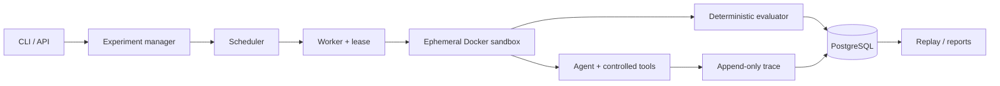

# AgentScope

**Evaluate how AI agents behave, fail, and recover.**

AgentScope runs coding agents against versioned software-engineering tasks in isolated Docker
containers, records every tool/model action, and scores the resulting patch with public and hidden
tests. It compares models separately from their tool harnesses, supports seeded fault injection,
and never substitutes an LLM opinion for an available deterministic check.

> Status: v0.1 engineering MVP. The local engine, mock agent, OpenAI-compatible adapter, Docker
> boundary, evaluator, trace replay, experiment matrix, PostgreSQL schema, API, scheduler, and a
> functional local dashboard are implemented. Distributed operation remains intentionally minimal. No benchmark
> or performance result is claimed in this repository.



## Quick start

Python 3.12 and Docker are required for isolated runs.

```bash
python3.12 -m venv .venv
source .venv/bin/activate
pip install -e '.[dev]'
docker build -t agentscope-sandbox:py312 -f sandbox/Dockerfile .
docker compose up -d postgres
alembic upgrade head
```

Run the example with a deterministic mock action script:

```json
[
  {
    "tool": "replace_text",
    "arguments": {
      "path": "cart.py",
      "old": "    total = sum(items)",
      "new": "    if not items:\n        return {\"status\": \"empty\", \"total\": 0}\n    total = sum(items)",
      "expected_replacements": 1
    }
  }
]
```

```bash
agentscope run --task examples/cart-empty-500/task.yaml --agent mock \
  --mock-actions actions.json --sandbox docker
agentscope replay run_ab12cd34ef56
agentscope serve --sandbox docker
```

For the local dashboard, use the launcher instead of opening `frontend/index.html` directly:

```bash
./scripts/start-dashboard.sh
```

Then open <http://127.0.0.1:8000/>. The launcher defaults to the local development sandbox;
set `AGENTSCOPE_SANDBOX=docker` when evaluating untrusted task code.

`--sandbox local` is convenient for harness development, but it executes code as a host process
and is never a security boundary.

## Evaluation methodology

Each run receives a fresh repository. Agent-visible tools accept typed arguments, reject path
traversal, execute argv without a shell, and enforce an allowlist and timeout. Once the agent
stops, hidden tests are copied into the sandbox for evaluation only.

The v0.1 score is fixed and auditable:

| Signal | Points |
|---|---:|
| Hidden tests pass | 70 |
| Public tests pass | 15 |
| Forbidden paths unchanged | 10 |
| Evaluation stays within timeout | 5 |

A completed run may still receive a failing evaluation; `COMPLETED` means the pipeline completed,
not that the task was solved. Sandbox provisioning failures, agent failures, timeouts, evaluation
failures, and cancellations are separate terminal states.

## Traces, experiments, and faults

Tool calls emit redacted call/result pairs with sequence, timestamps, latency, status, and errors.
Provider usage contains model calls and token counts. JSONL supports local replay; PostgreSQL tables
support durable traces and future object-storage references.

Experiments create the full task × agent-configuration matrix with the same task version and seed.
Model configuration and harness/tool configuration remain separate, preventing a tool improvement
from being mislabeled as a model improvement. Reports include solve rate, hidden-test rate, score,
runtime distribution, and failure counts, without automatic significance claims.

Fault policies inject seeded latency, timeout, and failure decisions at the tool boundary. A run is
reproducible from task hash, agent/model/prompt/tools, environment, fault policy, and seed—subject to
the unavoidable nondeterminism of remote models.

## Development

```bash
pytest
ruff check .
mypy agentscope
python scripts/performance.py --iterations 1000 --concurrency 4
```

The test suite uses `MockAgent` and local temporary workspaces, so it requires no paid API. Docker,
PostgreSQL, and provider integration tests are opt-in. The performance command prints observations
from the current machine; this README intentionally contains no fabricated figures.

```bash
AGENTSCOPE_TEST_DOCKER=1 AGENTSCOPE_TEST_POSTGRES=1 pytest -m "docker or integration"
```

## Security and limitations

Docker sandboxes disable networking, drop capabilities, set CPU/memory/PID limits, use an
unprivileged user and read-only root, and are destroyed after use. The Docker socket is never
mounted into an agent container and provider credentials remain host-side. Docker is still not a
perfect boundary; production deployments need a dedicated worker host, image provenance scanning,
seccomp/AppArmor, authentication, encrypted artifacts, and operational monitoring. See
[docs/security.md](docs/security.md).

Current limitations include Python-only task images, one real provider protocol, no authentication,
no object storage, database-backed leases that still need a worker daemon wrapper, an in-memory
dashboard API, and no exactly-once promise for nondeterministic model execution.

## Documentation

- [Architecture](docs/architecture.md) and [agent interface](docs/agent-interface.md)
- [Evaluation](docs/evaluation.md), [sandboxing](docs/sandboxing.md), and [tracing](docs/tracing.md)
- [Experiments](docs/experiments.md) and [reliability](docs/reliability.md)
- [Security](docs/security.md) and [roadmap](docs/roadmap.md)
- [Performance methodology and measured local sample](docs/performance.md)
- [Implementation plan](PLAN.md)

Apache-2.0 licensed.
