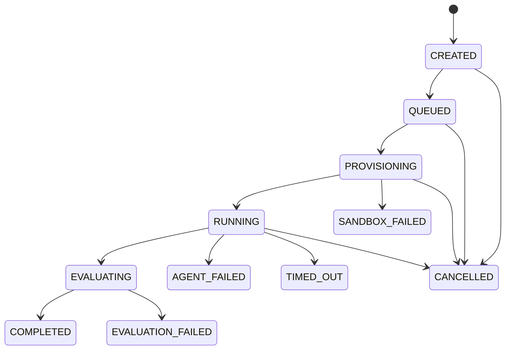

# Architecture

AgentScope uses ports-and-adapters boundaries. Frozen dataclasses and enums form the domain;
FastAPI/Pydantic, SQLAlchemy, Docker, HTTP providers, and JSONL are replaceable adapters. The run
engine owns orchestration but depends only on `Agent`, `Sandbox`, `Evaluator`, `RunRepository`, and
`TraceRecorder` protocols.

`COMPLETED` is an execution state. Task success is `EvaluationResult.passed`; conflating these makes
infrastructure reliability impossible to measure.

## Important decisions

1. **Nondeterministic reproduction.** Store task hash, environment, provider/model, prompt, tools,
   fault seed, and trace. Replay inspects recorded behavior; it does not claim a new model call will
   reproduce tokens.
2. **Failure ownership.** Sandbox/worker/database failures are infrastructure failures. Invalid
   model output, step exhaustion, and voluntary abort are agent failures. Test failures are measured
   task outcomes. Only explicit pre-outcome infrastructure failures are automatically retryable.
3. **Hidden tests.** They are outside the repository archive. The workspace is exported with safe
   tar filtering, the agent container is destroyed, and a fresh evaluator container receives hidden
   tests. Post-run agent processes cannot inspect them.
4. **Tool safety.** Agents call typed host-side handlers; paths are relative/validated and commands
   are argv allowlisted without shell parsing. The process still runs inside Docker limits.
5. **Trace data.** Record action type, sequence, monotonic duration, timestamp, status, bounded
   summaries, errors, provider identity, and usage. File bodies and secrets are redacted.
6. **Large payloads.** Database rows hold searchable metadata and bounded summaries. A future
   `ArtifactStore` will hold logs/diffs by content hash; giant blobs do not belong in JSONB.
7. **Worker claims.** PostgreSQL `FOR UPDATE SKIP LOCKED` assigns a lease, owner, attempt, and expiry.
   Heartbeats detect workers; renewal is conditional on ownership.
8. **Retries.** An expired lease before execution can be reassigned. A partially executed AI run is
   never transparently replayed; create a linked attempt because model output may differ.
9. **Costs.** Token usage is factual; monetary cost is computed with an independently versioned
   pricing catalog. Unknown prices produce no estimate.
10. **Fair comparison.** Use identical task versions, seeds, limits, evaluator, and concurrency
    conditions. Store model separately from harness, publish raw run counts, and make no automatic
    statistical-significance claim.

Redis is deferred: PostgreSQL is already authoritative and its row locks solve v0.1 claiming. Redis
becomes justified only when measured queue/database contention demands it.
